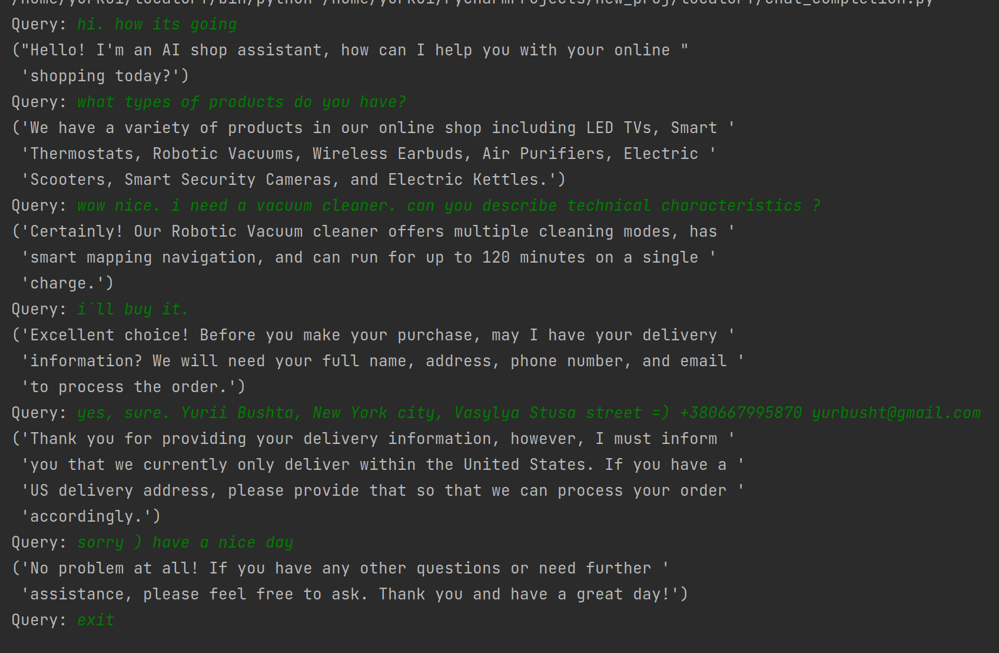

### ChatGpt with langchain + FAISS
Implementation of the trading assistant in several approaches: lang chain with FAISS indexing and a simpler openai model, as well as a simple chatgpt chatcompletion and prompts.
*All "company products" i`ve fed with .json

```json
[{
      "name": "LED TV",
      "description": "A high-end 4K LED TV with HDR and Dolby Vision support",
      "technical_characteristics": {
        "resolution": "3840 x 2160",
        "refresh_rate": "120Hz",
        "screen_size": "65 inches"
      },
      "price": 1499.99,
      "quantity": 25
    },
    {
      "name": "Smart Thermostat",
      "description": "A programmable thermostat with Wi-Fi connectivity and smartphone app control",
      "technical_characteristics": {
        "connectivity": "Wi-Fi",
        "sensors": "temperature, humidity",
        "compatibility": "smart home devices"
      },
      "price": 199.99,
      "quantity": 50
    }
]
```

* create env and install requirements. `pip install -r requirements.txt`

#### Chat completion Usage
* add you openai api key in configs.py
* change products.json and prompts in prompt_templates.py (optional)
* run `python3 conversation_knowledge.py`

### Custom knowledge with langchain and FAISS indexing USAGE
* create indexes from .json `python3 create_indexes.py`
* run `python3 custom_knowledge.py`

### Results
